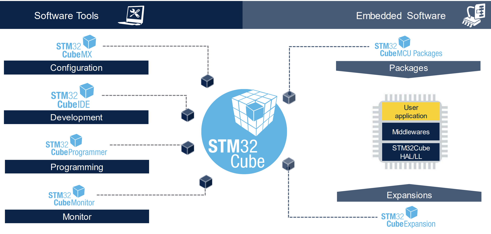

# IDE Primer

## Sammendrag
I denne leksjonen vil en enkel oversikt over STM32CubeIDE miljøet bli gitt.

## Miljøet
STM32CubeIDE består av et komplett miljø for å kunne drive med kode generering, utvikling, debugging og programmering av enheter. Det interessante er at den har innebygget en ganske unik visuell hardware konfigurator som lar deg generere skjelett kode med mye av oppsettskoden allerede lagt til avhengig av hvilken hardware du har definert du vil bruke.

## Hardware
Vi skal benytte oss av en enhet som heter en microcontroller i denne workshoppen. En microcontroller er kort fortalt en liten datamaskin integrert i en chip som inneholder alle komponenter(cpu, program minne, data minne og perifere input/output kretser) en trenger for å lagre og kjøre programmer og kommunisere med omverdenen.  Det finnes mange merker og typer og nå om dagen er kanskje AVR, ARM og ESP32 baserte microcontrollere de mest kjente. ARM er litt interessant siden arkitekturen er utviklet av et selskap som heter ARM og chip produsenter kan så lisensiere dette designet for å lage sine microcontrollere.  Microchip, NXP, Samsung, Apple og ST Electronics er noen av disse og i denne workshopen skal vi benytte oss en ARM basert microcontroller laget av ST Electronics.

Et ekspansjonskort har også blitt laget for å forenkle uttesting av forskjellige typer funksjonalitet som en del av denne workshoppen.

## Software
STM32CubeIDE software har en lagvis tilnærming til software utviklingen.  

Se under for hvordan disse er satt sammen.


### Middleware
Middleware består av høyere nivå drivere som for eksempel USB og RTOS funksjonalitet.  Disse driverne kan velges og konfigureres når en definerer hardware ressursene som en ønsker å bruke.

### HAL
HAL(Hardware Abstraction Libraries) bibliotekene består av et sett med høyere nivå funksjoner for å jobbe med hardware ressursene på microcontrolleren.  Typiske kall er å konfigurere ressurser i forhold til visse arbeidsoppgaver, spesifisere interrupts, starte og stoppe hardware komponenten. Kode generatoren i CubeIDE forutsetter bruk av disse bibliotekene i utgangspunktet.

### LL
LL(Low Level Libraries) bilbiotekene består av funksjoner som gir et veldig lavnivå tilgang til hardware ressursene.  Disse benyttes av HAL biliotekene, men utviklere står også fritt til å bruke disse hvis man trenger skikkelig lav nivå kontroll på ressursene.  Tilfeller dette kan være aktuelt er hvis en applikasjon trenger spesiell håndtering av hardware ressursene som ikke støttes av HAL bibliotekene. Dette er ikke veldig vanlig.

### Code Sections
CubeIDE kode generatoren lager vanligvis et prosjekt som er klar til å kompileres for din valgte microcontroller. Man står fritt til å endre hardware konfigurasjonen underveis mens man utvikler koden, men det er noen 'spilleregler' man må følge for at software og hardware endringer ikke gjør slik at kodegeneratoren sletter din applikasjonkode.

I ```main.c``` filen, så ser man tydelige ```/* USER CODE BEGIN xxx */``` og ```  /* USER CODE END xxx */``` seksjoner hvor man kan putte inn sin egen applikasjonskode som ikke vil gå i beina på kodegeneratoren. Det anbefales sterkt at man holder sin kode innenfor disse feltene og at man bruker disse forhåndsdefinerte områdene i ```main.c.``` og ```main.h```. Ellers vil kodegeneratoren slette koden din!  

Egen definerte kode filer vil kode generatoren holdes seg unna.