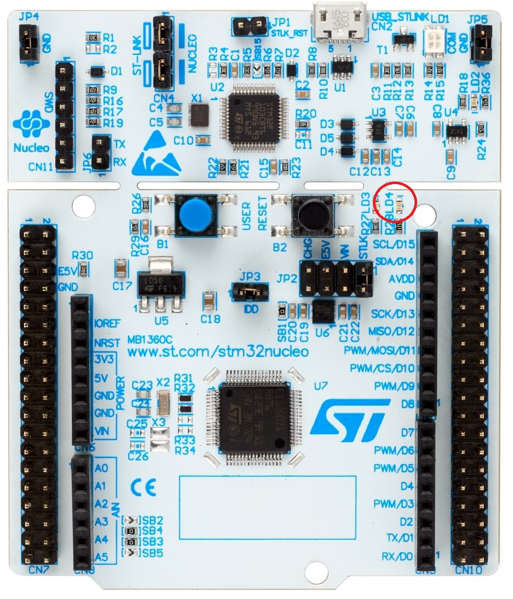

# Blinky

## Oversikt
I denne leksjonen skal du lære hvordan du lager ditt første prosjekt i STM32CubeIDE ved å lage den beryktete 'Hello World' ekvivalenten på en microcontroller => dvs å blinke en LED!

## Hardware Setup
Koble Nucleo kortet til din pc med medfølgende USB kabel. På kortet er en grønn LED med designasjon LD4. I software prosjektet som lages så refereres denne som LED_GREEN.  Det er denne vi skal lage et prosjekt for å styre. Se bilde under for et oversiktsbilde av utviklingskortet.



## Lage Et Nytt Prosjekt
- Åpne opp STM32CubeIDE
- Velg ```Start new STM32 project```
- Du vil nå bli presentert med STM32CubeIDE sin hardware picker. Her kan man velge konfigurasjon basert på microcontroller eller utviklingskort.
- Trykk på ```Board Selector``` tabben og tast in ```NUCLEO-G0B1RE``` under ```Commercial Part Number```.
- Under Boards List, så vil vårt utviklingskort dukke opp.  Velg dette og trykk ```Next``` knappen.
- Du vil nå få et vindu opp med ønsket project parametere.  Skriv inn ```blinky``` som projekt navn og la resten være med defaults. Trykk ```Finish``` knappen.
- I IDE grensesnittet, så vil du bli presentert med en grafisk representasjon av blinky.ios filen, som er filen man spesifiserer microcontrollerens hardware ressurser man ønsker å bruke i prosjektet. Siden vi har valgt et allerede kjent utviklingskort, så kan man se at pinnene på mikrokontrolleren er allerede satt opp.
- Legg merke til pinne PA5, som har fått et alias navn ```LED_GREEN```. På kretskortet så har denne designasjonen ```LD4```.   Utforsk gjerne grensesnittet her litt, ekspander for eksempel ```System Core``` seksjonen på venstre og trykk på ```GPIO```.  Da vil du få se ```LED_GREEN``` pinnen definert med sine attributer satt.  Gjør deg kjent med de forskjellige seksjonene.
- Under ```Project Explorer``` på venstre siden, ekspander ```Core``` folderen og så ```Src``` folderen. Du vil nå finne ```main.c``` filen, dobbelklikk på denne.
- Sjekk at prosjektet kompilerer ved å velge meny tittelen ```Project``` og så videre ```Build All```.
- Hvis det går bra, så er du klar til å legge til litt kode!  Finn seksjonen under i ```main.c``` filen:

```cpp
...
  /* Infinite loop */
  /* USER CODE BEGIN WHILE */

    /* USER CODE BEGIN 3 */
  }
  /* USER CODE END 3 */
```

Legg til følgende kode:

```cpp
...
  /* Infinite loop */
  /* USER CODE BEGIN WHILE */
  while (1)
  {
    /* USER CODE END WHILE */

    /* USER CODE BEGIN 3 */
    HAL_GPIO_TogglePin(LED_GREEN_GPIO_Port, LED_GREEN_Pin);
    HAL_Delay(500);
  }
  /* USER CODE END 3 */
```
- Sjekk at prosjektet kompilerer ved å velge meny tittelen ```Project``` og så videre ```Build All```.
- Hvis alt er ok, så kan du nå velge meny tittelen ```Run``` og så videre ```Run```. En pop up vil nok dukke opp med valg av debug konfigurasjon, aksepter defaults og gå videre.
- I noen tilfeller så vil miljøet spørre om du ønsker å oppdatere firmware på debuggeren som sitter på utviklingskortet, si ja til dette.
- Når prosessen er ferdig, så lastes din kode opp til kortet.  Du vil nå se at ```LD4/LED GREEN``` på kortet blinke av og på med 500ms mellomrom.
- Gratulerer, du har nå laget et prosjekt med kjørende kode for en STM32 mikrokontroller!
-  For å vise hardware debugging mulighetene, så kan du nå velge meny tittelen ```Run``` og så videre ```Debug```.  Miljøet vil nå laste opp siste versjon av koden til kortet og så stoppe ved første instruksjon i koden din.  
- Du kan nå velge å steppe inn/over/ut av kodesnutter i sanntid via knappene som er rett under meny baren. Du kan også samtidig se på variabler, definere breakpoints, se på assembler instruksjonene basert på hvor du er i koden. Enjoy!
- Andre tips: Trykk ```F3``` med musepilen over en funksjon for å hoppe til deklarasjonen av denne.  Nyttig å bruke med HAL funksjonene, siden dokumentasjonen for disse er å finne i kildekoden til disse.
