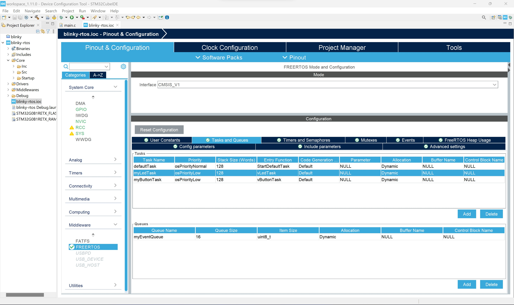
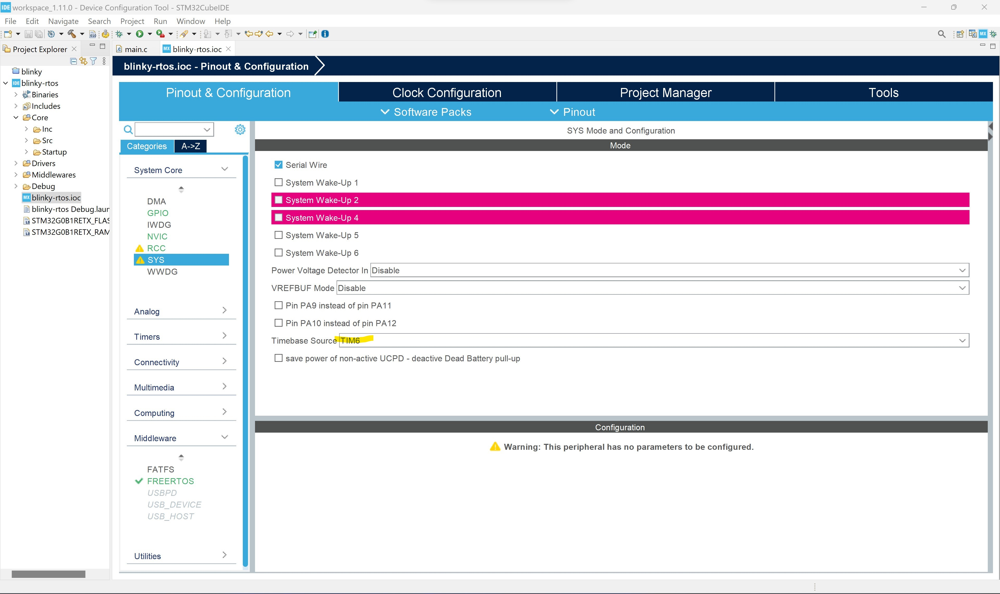

# Blinky FreeRTOS

## Oversikt
I denne leksjonen skal du lære hvordan du kan ta i bruk et sanntids operativ system som heter FreeRTOS.  Denne fungerer slik at en task manager vil styre alle oppgavene i systemet og gir dem kjøretid etter prioritet. 

Vår oppgave blir å lage små kodesnutter som fokuserer på hver sin oppgave.  

Rammeverket har også verktøy som meldingskøer for å få oppgavene til å kommunisere med hverandre og også tilgangskontrol som mutexer og sempahorer som hjelper med å sikre dedikert adgang til delte hardware ressurser.  

Mye spennende å lære om dette og en god referanse er å finne [her](http://www.disca.upv.es/aperles/arm_cortex_m3/curset/CMSIS/Documentation/RTOS/html/index.html).

Vi skal lage 2 oppgaver(en knapp/button reader og en led blinker) og disse skal kommunisere med hverandre via en meldingskø. Button oppgaven skal gi beskjed til køen om når den oppdager en knapp-ned eller en knapp-opp event.  LED oppgaven skal ved knapp-ned event(definert med en '1') skru på den grønne lysdioden og ved knapp-opp event(definert med en '2') skru den av igjen.  

Let's get going!

## Hardware Setup
Koble Nucleo kortet til din pc med medfølgende USB kabel. På kortet er en grønn LED med designasjon LD4. Denne skal LED task kontrollere.  Det finnes også en trykk knapp med designasjon USER.  Denne skal Button task lese av.

## Lage Et Nytt Prosjekt
- Åpne opp STM32CubeIDE
- Velg ```Start new STM32 project```
- Du vil nå bli presentert med STM32CubeIDE sin hardware velger. Her kan man velge konfigurasjon basert på microcontroller eller utviklingskort.
- Trykk på ```Board Selector``` tabben og tast in ```NUCLEO-G0B1RE``` under ```Commercial Part Number```.
- Under Boards List, så vil vårt utviklingskort dukke opp.  Velg dette og trykk ```Next``` knappen.
- Du vil nå få et vindu opp med ønsket project parametere.  Skriv inn ```blinky_rtos``` som projekt navn og la resten være med defaults. Trykk ```Finish``` knappen.
- STM32CubeIDE vil nå laste ned nødvendige filer og lage prosjektet ditt.
- I IDEen, så vil du bli presentert med en grafisk representasjon av blinky_rtos.ios filen, som er filen man spesifiserer microcontrollerens hardware ressurser man ønsker å bruke i prosjektet. Siden vi har valgt et allerede kjent utviklingskort, så kan man se at pinnene på mikrokontrolleren er allerede satt opp.
- Legg merke til pinne ```PA5```, som har fått et alias navn ```LED_GREEN```. Denne skal vi bruke til LED tasken vår.
- Legg merke til pinne ```PC13```, som har fått et alias navn ```USR_BTN```.  Denne skal vi bruke til Button tasken vår.
- Ekspander ```Middleware``` folderen til venstre og velg ```FREERTOS```.
- I ```FREERTOS Mode and Configuration``` menyen, så velger du ```CMSIS_V1``` i drop-down boksen.
- Under ```Configuration``` seksjonen, så legger du til 2 tasks med ```Add``` knappen. Egenskapene du skal fylle inn kan du se i skjermbildet under. Lag så en Queue med tilhørende ```Add``` knapp, egenskapene du skal fylle inn ser du i skjermbildet under.



- Under ```System Core``` menyen på venstre siden, velg så ```SYS``` kategorien. Finn ```Time Base Source``` settingen og sett denne til ```TIM6```.  Se skjermbilde under for hvordan dette ser ut.  Dette steget gjøres fordi RTOS bruker en timer i controlleren for å holde styr på tiden som går under navnet SYSTICK.  HAL bibliotekene bruker i utgangspunktet også SYSTICK timeren, men dette endrer vi i dette steget til TIM6 timeren. Nå slipper RTOS og HAL funskjonene å gå i beina på hverandre!



- Under ```Project Explorer``` på venstre siden, ekspander ```Core``` folderen og så ```Src``` folderen. Du vil nå finne ```main.c``` filen, dobbelklikk på denne.
- Sjekk at prosjektet kompilerer ved å velge meny tittelen ```Project``` og så videre ```Build All```.
- Hvis det går bra, så er du klar til å legge til litt kode!  Finn følgende seksjoner under i ```main.c``` filen og kopier inn kode som spesifisert.

```Private Macro```
```cpp
/* USER CODE BEGIN PM */
/* USER CODE END PM */
```

Legg til følgende kode:

```Private Macro```
```cpp
/* USER CODE BEGIN PM */
#define BUTTON_PUSH_EVENT 1
#define BUTTON_RELEASE_EVENT 2

/* USER CODE END PM */
```

```Button Task```
```cpp
...
/* USER CODE END Header_vButtonTask */
void vButtonTask(void const * argument)
{
  /* USER CODE BEGIN vButtonTask */
  /* Infinite loop */
  for(;;)
  {
    osDelay(100);
  }
  /* USER CODE END vButtonTask */
}
```

Legg til følgende kode:

```cpp
...
/* USER CODE END Header_vButtonTask */
void vButtonTask(void const * argument)
{
  /* USER CODE BEGIN vButtonTask */
  uint8_t curr_data = 0;
  uint8_t prev_data = 0;

  /* Infinite loop */
  for(;;)
  {
    osDelay(100);
    curr_data = HAL_GPIO_ReadPin(USR_BTN_GPIO_Port, USR_BTN_Pin);

    if (curr_data == GPIO_PIN_RESET && prev_data == GPIO_PIN_SET)
      osMessagePut(myEventQueueHandle, (uint32_t) BUTTON_PUSH_EVENT, 5);

    if (curr_data == GPIO_PIN_SET && prev_data == GPIO_PIN_RESET)
      osMessagePut(myEventQueueHandle, (uint32_t) BUTTON_RELEASE_EVENT, 5);

    prev_data = curr_data;
  }
  /* USER CODE END vButtonTask */
}
```

```Led Task```
```cpp
...
/* USER CODE END Header_vLedTask */
void vLedTask(void const * argument)
{
  /* USER CODE BEGIN vLedTask */
  /* Infinite loop */
  for(;;)
  {
    osDelay(100);
  }
  /* USER CODE END vLedTask */
}
```

Legg til følgende kode:

```cpp
...
/* USER CODE END Header_vLedTask */
void vLedTask(void const * argument)
{
  /* USER CODE BEGIN vLedTask */
  osEvent event;
  uint8_t curr_data = 0;

  /* Infinite loop */
  for(;;)
  {
    /*wait until kernel message*/
    event = osMessageGet(myEventQueueHandle, 100);

    /*if we are here, then receive message*/
    if (event.status == osEventMessage)
    {
      // get value
      curr_data = (uint8_t) event.value.v;

      if (curr_data == BUTTON_PUSH_EVENT)
        HAL_GPIO_WritePin(LED_GREEN_GPIO_Port, LED_GREEN_Pin, GPIO_PIN_SET);

      if (curr_data == BUTTON_RELEASE_EVENT)
        HAL_GPIO_WritePin(LED_GREEN_GPIO_Port, LED_GREEN_Pin, GPIO_PIN_RESET);
    }
  }
  /* USER CODE END vLedTask */
}
```
- Sjekk at prosjektet kompilerer ved å velge meny tittelen ```Project``` og så videre ```Build All```.
- Hvis alt er ok, så kan du nå velge meny tittelen ```Run``` og så videre ```Run```. En pop up kan dukke opp med valg av debug konfigurasjon, aksepter defaults og gå videre.
- I noen tilfeller så vil miljøet spørre om du ønsker å oppdatere firmware på debuggeren som sitter på utviklingskortet, si ja til dette.
- Når prosessen er ferdig, så lastes din kode opp til kortet.  Du vil nå se at LED4 på kortet blinke av og på avhengig av når du trykker inn eller slipper knappen!
- Gratulerer, du har nå laget et enkelt prosjekt med et sanntids operativ system for en STM32 mikrokontroller!  Dette kan være et spennende utganspunkt for å lage mere komplekse prosjektet med for eksempel en oppgave som implementerer en tilstandsmaskin basert på sensor verdier som puttes inn i en kø fra en oppgave som leser sensorer. 
