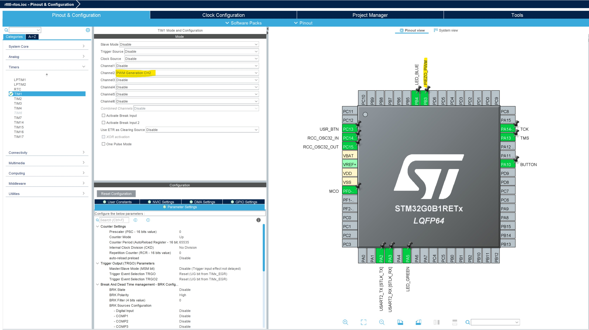

# RTTTL Player

## Oversikt
I denne leksjonen skal du lære hvordan du kan lage en artig [RTTTL](https://en.wikipedia.org/wiki/Ring_Tone_Text_Transfer_Language) player ved å bruke alt du har lært i de tidligere leksjonene pluss en del nytt vi skal gå igjennom i denne leksjonen. 

Vi skal benytte oss av 3 RTOS tasks(oppgaver).  Vi skal gjenbruke oppgavene fra forrige øvelse, dvs knapp og led oppgavene.  Den tredje oppgaven skal vi lage nå og den vil spille en sang ved å sette forskjellige telle verdier på en timer.  Utgangen på timeren vil generere firkantpulser med varierende duty cycle som vil generere forskjellige toner på piezo elementet som finnes på ekspansjonskortet.  Gøy!

Et vanlig oppsett når man utvikler i RTOS er at hver task har sin egen input queue som de titter på for nye ting oppgaven skal gjøre. I denne oppgaven så følger vi dette med at led og player taskene har hver sin queue, hvor button task vil legge til meldinger i disse for hvert knappetrykk.

Let's get going!

## Hardware Setup
Koble Nucleo kortet med ekspansjonskortet montert til din pc med medfølgende USB kabel.

## Lage Et Nytt Prosjekt
- Åpne opp STM32CubeIDE
- Lag et nytt prosjekt ved å gjenbruke hardware prosjektfilen fra forrige øvelse.  Dette gjøres ved å velge menyen ```File``` og så ```New``` og så ```STM32 Project from an Existing STM32CubeMX Configuration File (.ioc)```
- Finn og velg ```blinky_rtos.ios``` filen fra forrige øvelse.
- Du vil nå få et vindu opp med ønsket project parametere.  Skriv inn ```rtttl-rtos``` som projekt navn og la resten være med defaults. Trykk ```Finish``` knappen.
- STM32CubeIDE vil nå laste ned nødvendige filer og lage prosjektet ditt.
- Det er mulig IDEen vil gi deg en advarsel, klikk på at du vil fortsatt generere kode.
- I IDEen, så vil du bli presentert med en grafisk representasjon av rtttl_rtos.ios filen, som er filen man spesifiserer microcontrollerens hardware ressurser man ønsker å bruke i prosjektet. Siden vi har valgt et allerede kjent utviklingskort, så kan man se at pinnene på mikrokontrolleren er allerede satt opp.
- Venstre klikk på ```PB3``` pinnen. Velg ```TIM1_CH2 ```.  Her spesifiserer vi at vi ønsker å bruke denne pinnen som en utgang fra hardware timeren TIM1 og utgang 2 fra denne. Du vil se at denne skifter farge til gul, dette fordi vi ikke har konfigurert timeren enda.
- Høyre klikk på ```PB3``` pinnen og velg ```Enter User Label```. Skriv inn navnet ```PIEZO_PWM```.
- På venstre side, ekspander ```Timers ``` dropdown og velg ```TIM1```. På ```Channel2```, velg ```PWM Generation CH2```.  Sjekk bilde under for verifikasjon. Under ```Configuration``` seksjonen, påse at PWM Mode 1 er valgt for ```PWM Generation Channel 2```.



- Ekspander ```Middleware``` folderen til venstre og velg ```FREERTOS```.
- I ```FREERTOS Mode and Configuration``` menyen, så velger du ```CMSIS_V1``` i drop-down boksen. Vi må også øke ```TOTAL_HEAP_SIZE``` konfigurasjonen til FreeRTOS for dette prosjektet, dette gjøres ved å legge inn 4096 i konfig feltet til ```TOTAL_HEAP_SIZE``` feltet. Se under for detaljer.


- Under ```Configuration``` seksjonen, så legger du til en ```Task``` med ```Add``` knappen i tillegg til de andre taskene vi definerte i forrige oppgave. Egenskapene du skal fylle inn kan du se i skjermbildet under. Lag så en ```Queue``` med tilhørende ```Add``` knapp, egenskapene du skal fylle inn ser du i skjermbildet under. Påse at kø og oppgavene navnene samsvarer med skjermbildet!


- Sjekk at ```USE_NEWLIB_REENTRANT``` er fortsatt satt til ```Enabled``` under ```Advanced Settings```.
- Under ```Project Explorer``` på venstre siden, ekspander ```Core``` folderen og så ```Src``` folderen. Du vil nå finne ```main.c``` filen, dobbelklikk på denne. IDEen vil nok spørre om du vil generere kode først, si ja til dette.
- Sjekk at prosjektet kompilerer ved å velge meny tittelen ```Project``` og så videre ```Build All```.
- Hvis det går bra, så er du klar til å legge til litt mere kode!  Finn følgende seksjoner under i ```main.c``` filen og kopier inn kode som spesifisert.

```/* USER CODE BEGIN Includes */```

Legg til følgende kode:
```cpp
...
/* USER CODE BEGIN Includes */
#include "rtttl.h"
/* USER CODE END Includes */
```

```/* USER CODE BEGIN PD */```

Legg til følgende kode:
```cpp
...
/* USER CODE BEGIN PD */
#define BUTTON_PUSH_EVENT			1
#define BUTTON_RELEASE_EVENT	2
/* USER CODE END PD */
```

```/* USER CODE BEGIN PV */```

Legg til følgende kode:
```cpp
...
/* USER CODE BEGIN PV */
st_rtttl_t rtttl_info;
//const unsigned char melody[] = "TheSimpsons:d=4,o=5,b=160:c.6,e6,f#6,8a6,g.6,e6,c6,8a,8f#,8f#,8f#,2g,8p,8p,8f#,8f#,8f#,8g,a#.,8c6,8c6,8c6,c6\0";
//const unsigned char melody[] = "comicb:d=4,o=5,b=125:8g,16g,16g,16f6,16g6,16g,16g,8g,16g,16g,16f6,16g6,16g,16g,8a#,16a#,16a#,16g#6,16a#6,16a#,16a#,8f,16f,16f,16d#6,16f6,16f,16f,8g,16g,16g,16f6,16g6,16g,16g,8g,16g,16g,16f6,16g6,16g,16g,8a#,16a#,16a#,16g#6,16a#6,16a#,16a#,8c6,16c6,16c6,16a#6,16c7,16c6,16c6\0";
//const unsigned char melody[] = "Chariots of Fire:d=16,o=5,b=85:8c#,f#.,g#.,a#.,4g#,4f,8p,8c#,f#.,g#.,a#.,2g#,8p,8c#,f#.,g#.,a#.,4g#,4f,8p,8f,f#.,f.,c#.,2c#\0";
//const unsigned char melody[] = "Death March:d=4,o=5,b=100:4c,16p,c,8c,32p,2c,d#,8d,32p,d,8c,32p,c,8b4,32p,2c.\0";
//const unsigned char melody[] = "GeorgeofthejungleTheme:d=4,o=6,b=127:f5,p,p,c5,p,p,f5,p,f5,p,f5,a5,p,c,p,f5,p,f5,p,g5,g5,p,a5,p,p,p,f5,f5,f5,f5,g5,g5,p,f5,p,p,p,f";
//const unsigned char melody[] = "OneMoreT:d=16,o=5,b=125:4e,4e,4e,4e,4e,4e,8p,4d#.,4e,4e,4e,4e,4e,4e,8p,4d#.,4e,4e,4e,4e,4e,4e,8p,4d#.,4f#,4f#,4f#,4f#,4f#,4f#,8f#,4d#.,4e,4e,4e,4e,4e,4e,8p,4d#.,4e,4e,4e,4e,4e,4e,8p,4d#.,1f#,2f#";
//const unsigned char melody[] = "The Simpsons:d=4,o=5,b=160:c.6,e6,f#6,8a6,g.6,e6,c6,8a,8f#,8f#,8f#,2g,8p,8p,8f#,8f#,8f#,8g,a#.,8c6,8c6,8c6,c6";
//const unsigned char melody[] = "Indiana:d=4,o=5,b=250:e,8p,8f,8g,8p,1c6,8p.,d,8p,8e,1f,p.,g,8p,8a,8b,8p,1f6,p,a,8p,8b,2c6,2d6,2e6,e,8p,8f,8g,8p,1c6,p,d6,8p,8e6,1f.6,g,8p,8g,e.6,8p,d6,8p,8g,e.6,8p,d6,8p,8g,f.6,8p,e6,8p,8d6,2c6";
//const unsigned char melody[] = "TakeOnMe:d=4,o=4,b=160:8f#5,8f#5,8f#5,8d5,8p,8b,8p,8e5,8p,8e5,8p,8e5,8g#5,8g#5,8a5,8b5,8a5,8a5,8a5,8e5,8p,8d5,8p,8f#5,8p,8f#5,8p,8f#5,8e5,8e5,8f#5,8e5,8f#5,8f#5,8f#5,8d5,8p,8b,8p,8e5,8p,8e5,8p,8e5,8g#5,8g#5,8a5,8b5,8a5,8a5,8a5,8e5,8p,8d5,8p,8f#5,8p,8f#5,8p,8f#5,8e5,8e5";
//const unsigned char melody[] = "Entertainer:d=4,o=5,b=140:8d,8d#,8e,c6,8e,c6,8e,2c.6,8c6,8d6,8d#6,8e6,8c6,8d6,e6,8b,d6,2c6,p,8d,8d#,8e,c6,8e,c6,8e,2c.6,8p,8a,8g,8f#,8a,8c6,e6,8d6,8c6,8a,2d6";
//const unsigned char melody[] = "Muppets:d=4,o=5,b=250:c6,c6,a,b,8a,b,g,p,c6,c6,a,8b,8a,8p,g.,p,e,e,g,f,8e,f,8c6,8c,8d,e,8e,8e,8p,8e,g,2p,c6,c6,a,b,8a,b,g,p,c6,c6,a,8b,a,g.,p,e,e,g,f,8e,f,8c6,8c,8d,e,8e,d,8d,c";
//const unsigned char melody[] = "Xfiles:d=4,o=5,b=125:e,b,a,b,d6,2b.,1p,e,b,a,b,e6,2b.,1p,g6,f#6,e6,d6,e6,2b.,1p,g6,f#6,e6,d6,f#6,2b.,1p,e,b,a,b,d6,2b.,1p,e,b,a,b,e6,2b.,1p,e6,2b.";
//const unsigned char melody[] = "Looney:d=4,o=5,b=140:32p,c6,8f6,8e6,8d6,8c6,a.,8c6,8f6,8e6,8d6,8d#6,e.6,8e6,8e6,8c6,8d6,8c6,8e6,8c6,8d6,8a,8c6,8g,8a#,8a,8f";
//const unsigned char melody[] = "20thCenFox:d=16,o=5,b=140:b,8p,b,b,2b,p,c6,32p,b,32p,c6,32p,b,32p,c6,32p,b,8p,b,b,b,32p,b,32p,b,32p,b,32p,b,32p,b,32p,b,32p,g#,32p,a,32p,b,8p,b,b,2b,4p,8e,8g#,8b,1c#6,8f#,8a,8c#6,1e6,8a,8c#6,8e6,1e6,8b,8g#,8a,2b";
//const unsigned char melody[] = "Bond:d=4,o=5,b=80:32p,16c#6,32d#6,32d#6,16d#6,8d#6,16c#6,16c#6,16c#6,16c#6,32e6,32e6,16e6,8e6,16d#6,16d#6,16d#6,16c#6,32d#6,32d#6,16d#6,8d#6,16c#6,16c#6,16c#6,16c#6,32e6,32e6,16e6,8e6,16d#6,16d6,16c#6,16c#7,c.7,16g#6,16f#6,g#.6";
//const unsigned char melody[] = "MASH:d=8,o=5,b=140:4a,4g,f#,g,p,f#,p,g,p,f#,p,2e.,p,f#,e,4f#,e,f#,p,e,p,4d.,p,f#,4e,d,e,p,d,p,e,p,d,p,2c#.,p,d,c#,4d,c#,d,p,e,p,4f#,p,a,p,4b,a,b,p,a,p,b,p,2a.,4p,a,b,a,4b,a,b,p,2a.,a,4f#,a,b,p,d6,p,4e.6,d6,b,p,a,p,2b";
const unsigned char melody[] =
    "StarWars:d=4,o=5,b=45:32p,32f#,32f#,32f#,8b.,8f#.6,32e6,32d#6,32c#6,8b.6,16f#.6,32e6,32d#6,32c#6,8b.6,16f#.6,32e6,32d#6,32e6,8c#.6,32f#,32f#,32f#,8b.,8f#.6,32e6,32d#6,32c#6,8b.6,16f#.6,32e6,32d#6,32c#6,8b.6,16f#.6,32e6,32d#6,32e6,8c#6";
//const unsigned char melody[] = "GoodBad:d=4,o=5,b=56:32p,32a#,32d#6,32a#,32d#6,8a#.,16f#.,16g#.,d#,32a#,32d#6,32a#,32d#6,8a#.,16f#.,16g#.,c#6,32a#,32d#6,32a#,32d#6,8a#.,16f#.,32f.,32d#.,c#,32a#,32d#6,32a#,32d#6,8a#.,16g#.,d#";
//const unsigned char melody[] = "TopGun:d=4,o=4,b=31:32p,16c#,16g#,16g#,32f#,32f,32f#,32f,16d#,16d#,32c#,32d#,16f,32d#,32f,16f#,32f,32c#,16f,d#,16c#,16g#,16g#,32f#,32f,32f#,32f,16d#,16d#,32c#,32d#,16f,32d#,32f,16f#,32f,32c#,g#";
//const unsigned char melody[] = "A-Team:d=8,o=5,b=125:4d#6,a#,2d#6,16p,g#,4a#,4d#.,p,16g,16a#,d#6,a#,f6,2d#6,16p,c#.6,16c6,16a#,g#.,2a#";
//const unsigned char melody[] = "Flinstones:d=4,o=5,b=40:32p,16f6,16a#,16a#6,32g6,16f6,16a#.,16f6,32d#6,32d6,32d6,32d#6,32f6,16a#,16c6,d6,16f6,16a#.,16a#6,32g6,16f6,16a#.,32f6,32f6,32d#6,32d6,32d6,32d#6,32f6,16a#,16c6,a#,16a6,16d.6,16a#6,32a6,32a6,32g6,32f#6,32a6,8g6,16g6,16c.6,32a6,32a6,32g6,32g6,32f6,32e6,32g6,8f6,16f6,16a#.,16a#6,32g6,16f6,16a#.,16f6,32d#6,32d6,32d6,32d#6,32f6,16a#,16c.6,32d6,32d#6,32f6,16a#,16c.6,32d6,32d#6,32f6,16a#6,16c7,8a#.6";
//const unsigned char melody[] = "Jeopardy:d=4,o=6,b=125:c,f,c,f5,c,f,2c,c,f,c,f,a.,8g,8f,8e,8d,8c#,c,f,c,f5,c,f,2c,f.,8d,c,a#5,a5,g5,f5,p,d#,g#,d#,g#5,d#,g#,2d#,d#,g#,d#,g#,c.7,8a#,8g#,8g,8f,8e,d#,g#,d#,g#5,d#,g#,2d#,g#.,8f,d#,c#,c,p,a#5,p,g#.5,d#,g#";
//const unsigned char melody[] = "Gadget:d=16,o=5,b=50:32d#,32f,32f#,32g#,a#,f#,a,f,g#,f#,32d#,32f,32f#,32g#,a#,d#6,4d6,32d#,32f,32f#,32g#,a#,f#,a,f,g#,f#,8d#";
//const unsigned char melody[] = "Smurfs:d=32,o=5,b=200:4c#6,16p,4f#6,p,16c#6,p,8d#6,p,8b,p,4g#,16p,4c#6,p,16a#,p,8f#,p,8a#,p,4g#,4p,g#,p,a#,p,b,p,c6,p,4c#6,16p,4f#6,p,16c#6,p,8d#6,p,8b,p,4g#,16p,4c#6,p,16a#,p,8b,p,8f,p,4f#";
//const unsigned char melody[] = "MahnaMahna:d=16,o=6,b=125:c#,c.,b5,8a#.5,8f.,4g#,a#,g.,4d#,8p,c#,c.,b5,8a#.5,8f.,g#.,8a#.,4g,8p,c#,c.,b5,8a#.5,8f.,4g#,f,g.,8d#.,f,g.,8d#.,f,8g,8d#.,f,8g,d#,8c,a#5,8d#.,8d#.,4d#,8d#.";
//const unsigned char melody[] = "LeisureSuit:d=16,o=6,b=56:f.5,f#.5,g.5,g#5,32a#5,f5,g#.5,a#.5,32f5,g#5,32a#5,g#5,8c#.,a#5,32c#,a5,a#.5,c#.,32a5,a#5,32c#,d#,8e,c#.,f.,f.,f.,f.,f,32e,d#,8d,a#.5,e,32f,e,32f,c#,d#.,c#";
//const unsigned char melody[] = "DangerMo:d=4,o=5,b=355:a.,8g,a,8a,p,8a4,8p,d,p,a.,8g,a,8a,p,8a4,8p,d,p,a,a,a#,a#,a#,a#,a#,a#,a#,c6,2a,p,8a4,8p,d,p,a.,8g,a,8a,p,8a4,8p,d,p,a.,8g,a,8a,p,8a4,8p,d,p,a,a,a#,a#,a#,a#,a#,a#,a#,c6,2d6,p,8a4,8p,d,p,a.,8a,2a#.,8a#4,8p,d#,2p,a#,2a#,2f#,2d#,a#.,8a#,2b.,8b4,8p,e,2p,b,2b,2g,2e,b.,8d6,1e.6,e6,8e6,8e";
//const unsigned char melody[] = "MissionImp:d=16,o=6,b=95:32d,32d#,32d,32d#,32d,32d#,32d,32d#,32d,32d,32d#,32e,32f,32f#,32g,g,8p,g,8p,a#,p,c7,p,g,8p,g,8p,f,p,f#,p,g,8p,g,8p,a#,p,c7,p,g,8p,g,8p,f,p,f#,p,a#,g,2d,32p,a#,g,2c#,32p,a#,g,2c,a#5,8c,2p,32p,a#5,g5,2f#,32p,a#5,g5,2f,32p,a#5,g5,2e,d#,8d";

/* USER CODE END PV */
```
Du må gjerne velge din egen sang ved å kommentere ut linjen som er valgt og fjerne kommentar tegnene på en sang du ønsker.

```int main(void)```

Legg til følgende kode:
```cpp
...
/* USER CODE BEGIN 2 */
rtttl_info.tim_ref = &htim1;
rtttl_info.tim_channel = TIM_CHANNEL_2;
/* USER CODE END 2 */

```

```vButtonTask```

Legg til følgende kode:

```cpp
...
/* USER CODE END Header_vButtonTask */
void vButtonTask(void const *argument) {
  /* USER CODE BEGIN vButtonTask */
  uint8_t curr_data = 0;
  uint8_t prev_data = 0;

  /* Infinite loop */
  for (;;) {
    osDelay(100);
    curr_data = HAL_GPIO_ReadPin(BUTTON_GPIO_Port, BUTTON_Pin);

    if (curr_data == GPIO_PIN_RESET && prev_data == GPIO_PIN_SET) {
      osMessagePut(myLedEventQueueHandle, (uint32_t) BUTTON_PUSH_EVENT, 0);
      osMessagePut(myPlayerEventQueueHandle, (uint32_t) BUTTON_PUSH_EVENT, 0);
    }

    if (curr_data == GPIO_PIN_SET && prev_data == GPIO_PIN_RESET) {
      osMessagePut(myLedEventQueueHandle, (uint32_t) BUTTON_RELEASE_EVENT, 0);
    }

    prev_data = curr_data;
  }
  /* USER CODE END vButtonTask */
}
```

```vLedTask```

Legg til følgende kode:
```cpp
...
/* USER CODE END Header_vLedTask */
void vLedTask(void const *argument) {
  /* USER CODE BEGIN vLedTask */
  osEvent event;
  uint8_t curr_data = 0;

  /* Infinite loop */
  for (;;) {
    /*wait until kernel message*/
    event = osMessageGet(myLedEventQueueHandle, 10);

    /*if we are here, then receive message*/
    if (event.status == osEventMessage) {
      // get value
      curr_data = (uint8_t) event.value.v;

      if (curr_data == BUTTON_PUSH_EVENT)
        HAL_GPIO_WritePin(LED_BLUE_GPIO_Port, LED_BLUE_Pin, GPIO_PIN_SET);

      if (curr_data == BUTTON_RELEASE_EVENT)
        HAL_GPIO_WritePin(LED_BLUE_GPIO_Port, LED_BLUE_Pin, GPIO_PIN_RESET);
    }
  }
  /* USER CODE END vLedTask */
}
```

```vPlayerTask```

Legg til følgende kode:
```cpp
...
/* USER CODE END Header_vPlayerTask */
void vPlayerTask(void const *argument) {
  /* USER CODE BEGIN vPlayerTask */
  osEvent event;
  uint8_t curr_data = 0;

  /* Infinite loop */
  for (;;) {

    /*wait until kernel message*/
    event = osMessageGet(myPlayerEventQueueHandle, 10);

    /*if we are here, then receive message*/
    if (event.status == osEventMessage) {
      // get value
      curr_data = (uint8_t) event.value.v;

      if (curr_data == BUTTON_PUSH_EVENT) {
        if (rtttl_info.playing) {
          rtttl_stop(&rtttl_info);
        } else {
          rtttl_info.tune_data = &melody[0];
          rtttl_start(&rtttl_info);
        }
      }
    } else {
      // no new queue message received, keep playing if player is enabled
      rtttl_play(&rtttl_info);
    }

  }
  /* USER CODE END vPlayerTask */
}
```

- Nå må du legge til en kilde fil med navn [rtttl.c](/doc/rtttl.c) og tilhørende include fil [rtttl.h](/doc/rtttl.h).  Dette kan gjøres ved å lage nye filer i ```Src``` og ```Inc``` folderne under ```Core``` under prosjektnavigatøren på venstre side og så kopiere inn kildekoden fra filene i lenkene. Husk at ```rtttl.c``` skal i ```Src``` folderen og ```rtttl.h``` skal i ```Inc``` folderen.
- Sjekk at prosjektet kompilerer ved å velge meny tittelen ```Project``` og så videre ```Build All```.
- Hvis alt er ok, så kan du nå velge meny tittelen ```Run``` og så videre ```Run```. En pop up kan dukke opp med valg av debug konfigurasjon, aksepter defaults og gå videre.
- I noen tilfeller så vil miljøet spørre om du ønsker å oppdatere firmware på debuggeren som sitter på utviklingskortet. Si ja til dette.
- Når prosessen er ferdig, så lastes din kode opp til kortet.  Du vil nå se at LED_BLUE på kortet blinke av og på avhengig av når du trykker inn eller slipper knappen. Du vil også høre en sang spille hvis alt er riktig kodet og koblet opp! Ved å trykke inn knappen igjen, så vil avspillingen avsluttes. 
- Gratulerer, du har nå laget et enkelt prosjekt med et sanntids operativ system for en STM32 mikrokontroller som spiller musikk!
